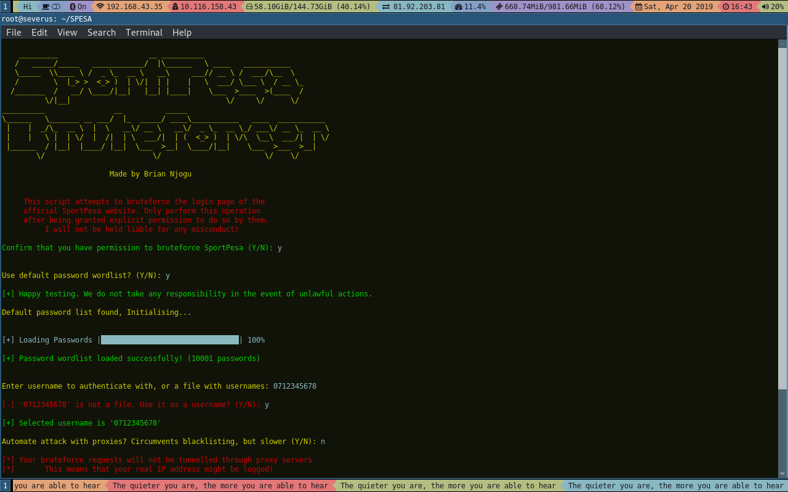
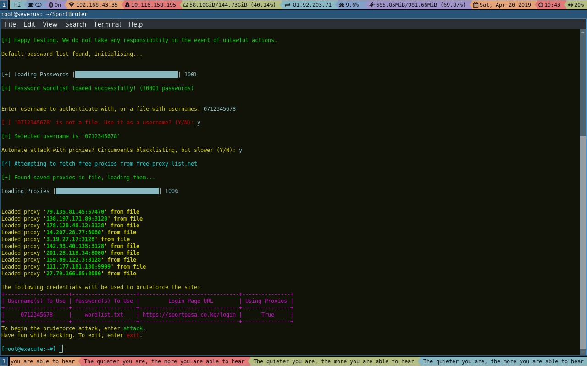
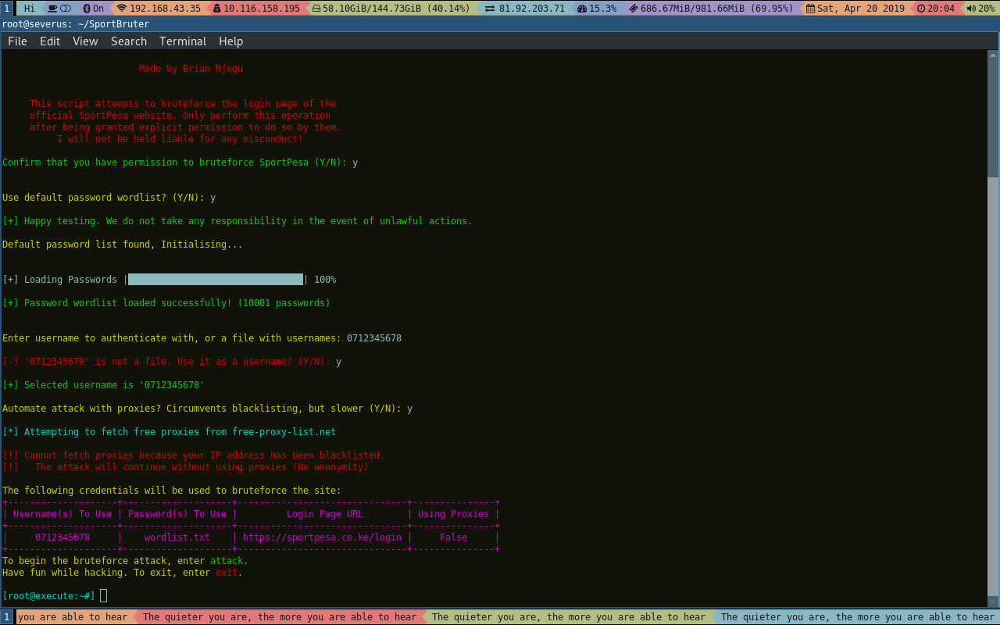

# Sport Bruter

> Simple tool to brute-force the login page of the official SportPesa website.

[]()
[]()
[]()
[]()
[]()

SportBruter is a little script I wrote that tries to authenticate as a user against a defined list of passwords on the login page of [SportPesa](https://sportpesa.co.ke), a Kenyan betting platform.

[](https://asciinema.org/a/fz787azSdbP34fi9iE7dpf0hd)

Depending on user preference, it gathers a list of free proxies to use, and launches a per-request dictionary attack using the provided credentials. If a pair of credentials authenticate, execution is halted and the results saved to a file.  

The script has been written in Python 3, as such, trying to run it using Python 2 will cause it to fail.

## Installation

To get started, you pretty much just have to clone the script:

```sh
git clone https://github.com/briancanspit/SportBruter.git
```

Then, get into the directory itself:

```sh
cd
```

Finally, install the dependencies it needs by running:

```sh
python3 -m pip install -r requirements.txt
```

## Usage example

This script depends on Python 3 or its variants. To run it, simply execute:

```sh
python3 sportbruter.py
```



If you choose to use proxies when prompted, the script goes ahead to scrape [https://free-proxy-list.net]() for free proxies, and if it successfully gathers at least one proxy, it saves them to the file ``proxy.lst``. This file guarantees that the next time you run the script and you find out that your IP cannot scrape for more proxies because of being blacklisted, you still have the previous proxy list. If you have your own proxies that you'd like to use, place them in the file in the format ``ip:port`` as shown below:

 

It is important to note that the statements preceded by ``#`` are comments and have only been placed there to elaborate on how you should write to the file. As such, do not include anything other than the proxies themselves in this file. Also, when you select to use proxies, this script overwrites the ``proxy.lst`` file. Thus, only introduce your own proxies after the script tells you that your IP cannot scrape for free proxies because it has been blacklisted, to avoid losing the proxies you specify in the file. If you follow this and all goes well, you should see something like this:



From there, all your connections will be tunneled through the specified proxies, as selected. If it does not find an existing ``proxy.lst`` file (most likely because the user deleted the file manually after his IP had already been blacklisted), it will default to making the requests directly from your public IP. 



## 

If you run into any issues concerning failed module importation, it means you did not install the modules found in the requirements.txt file.

To fix this, run the command below in your terminal (not the Python console):

```sh
python3 -m pip install -r requirements.txt
```

Or, if that doesn't work, directly invoke pip, by running:

```sh
pip install -r requirements.txt
```

This should fix any import errors you might have.

## To Do

``Implement threading``

``Implement resumption on return after exit``

``Parse command line arguments for flexibility``

## Meta

Shoot me a message on Twitter- [@briancanspit](https://twitter.com/briancanspit)

Follow me on Instagram- [@briancanspit](https://instagram.com/briancanspit)

Or email me - briancanspit@gmail.com

Distributed under the MIT license. See ``LICENSE`` for more information.

